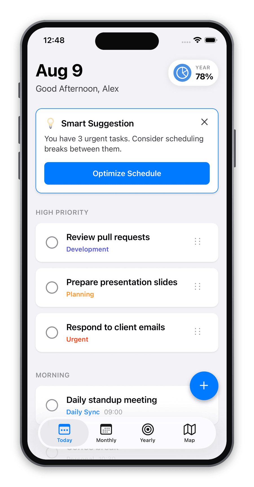
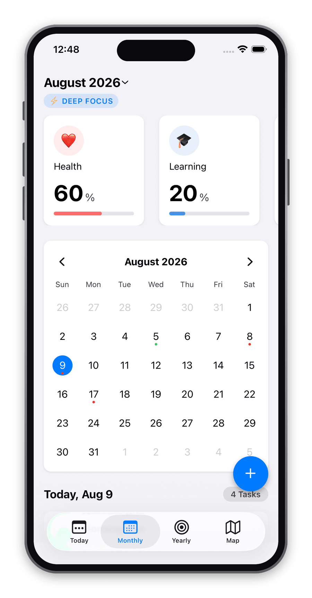
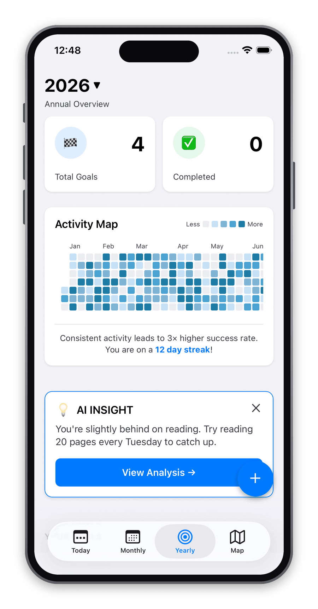

# Ease

Ease is a yearly goal planner app built with [Expo](https://expo.dev) that helps you break down your goals from daily tasks to monthly and yearly views, with a map view for managing tasks.

> 🚧 **This project is still under development and not yet complete. Stay tuned!**

## Preview

|                         Today                         |                          Monthly                          |                         Yearly                          |
| :---------------------------------------------------: | :-------------------------------------------------------: | :-----------------------------------------------------: |
|  |  |  |

## Tech Stack

- **Expo SDK 54** on the new React Native architecture, with React Compiler turned on
- **TypeScript**, strict mode
- **expo-router** for file-based navigation
- **react-native-reanimated** + **react-native-gesture-handler** + **react-native-draggable-flatlist** for the drag-and-drop priority list
- **react-native-calendars** for the monthly view
- **react-native-svg** for the yearly activity heatmap
- **expo-haptics** for the little bit of tactile feedback when you drag or check off a task
- UI is modeled after iOS Human Interface Guidelines — colors, spacing, and typography all live in `constants/theme.ts`

No backend yet, everything runs on local/mock data for now while I focus on getting the UI and interactions right first.

## What's Next

- [ ] Finish the Yearly screen (activity heatmap, goal progress, AI insights) — in progress, see `docs/features/in-progress/yearly.md`
- [ ] Build out the Map view, which is currently just a "Coming soon" placeholder
- [ ] Add real data persistence (leaning towards AsyncStorage or a lightweight backend, haven't decided yet)
- [ ] Make the "Smart Suggestion" card actually smart instead of static copy
- [ ] Swap the emoji tab bar icons for proper SF Symbols / vector icons
- [ ] Cut a TestFlight build once the core flows feel solid

This is a side project I'm chipping away at in my spare time, so things will be rough around the edges for a while. Ideas and feedback are welcome!

## Get started

1. Install dependencies

   ```bash
   npm install
   ```

2. Start the app

   ```bash
   npx expo start
   ```

In the output, you'll find options to open the app in a

- [development build](https://docs.expo.dev/develop/development-builds/introduction/)
- [Android emulator](https://docs.expo.dev/workflow/android-studio-emulator/)
- [iOS simulator](https://docs.expo.dev/workflow/ios-simulator/)
- [Expo Go](https://expo.dev/go), a limited sandbox for trying out app development with Expo

You can start developing by editing the files inside the **app** directory. This project uses [file-based routing](https://docs.expo.dev/router/introduction).
